# Reddy Divya - React JS Developer Portfolio

## Table of Contents

## Introduction

    Discover my portfolio, a collection of professional materials showcasing my skills, training, and experiences, offering insights into my personality and work ethic.

## Features

    - About Me
    - Work Experience
    - Projects Show Case
    - Technical Skills
    - Contact
    - Responsive Design

## Demo

    Check out the live demo [My Portfolio](https://reddy-divya-portfolio.netlify.app/)

## Installation

    To set up the project locally, follow these steps:

### Prerequisites

    Make sure you have the following installed on your system:
    - Node.js (v14.x or later)
    - npm (v6.x or later) or yarn (v1.x or later)

### Create Project

    ```
    create-react-app divya_portfolio
    ```

## Start the Project

    ```
    cd divya_portfolio
    npm start
    ```

## Building for Production

    ```
    npm run build
    ```

## Usage

    Explore the projects, read about my skills, and contact me through the mail.

## Screenshots

### Dark Mode

    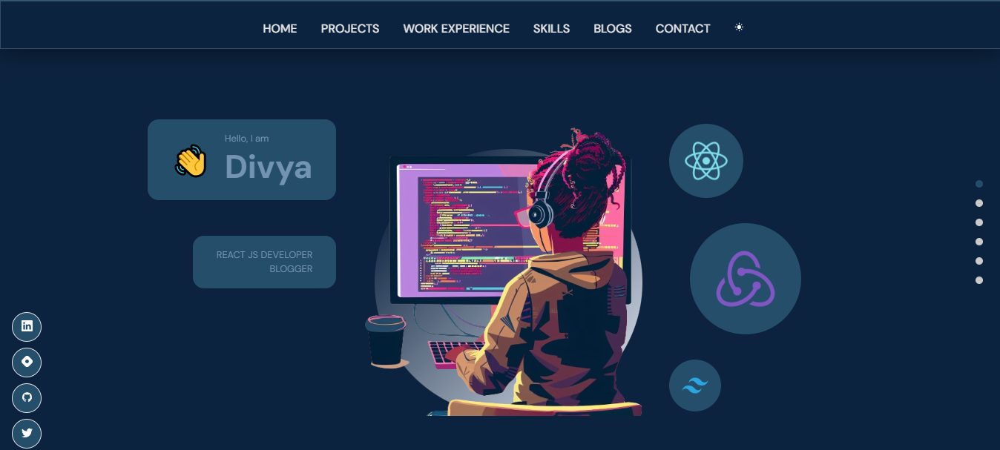
    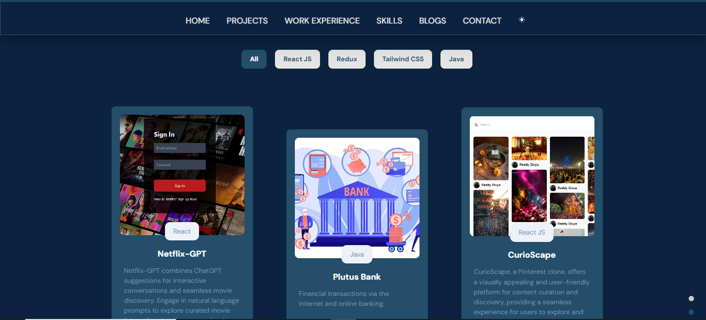
    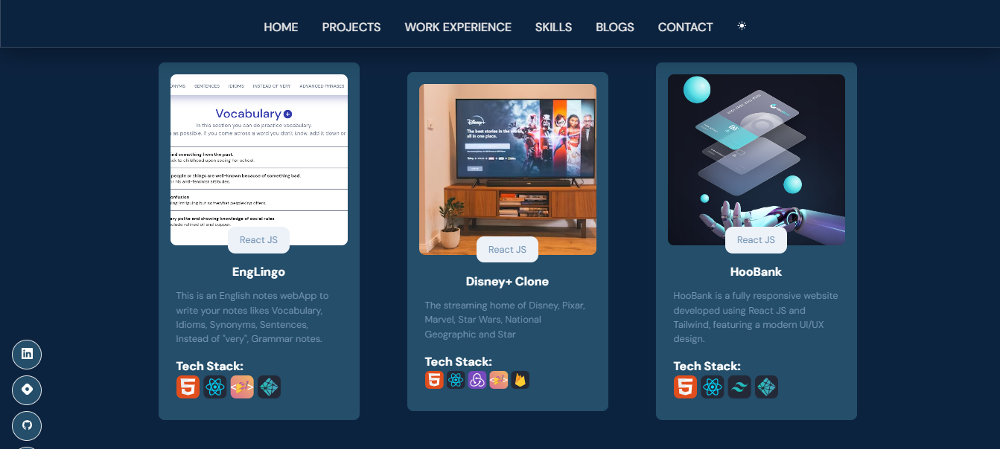
    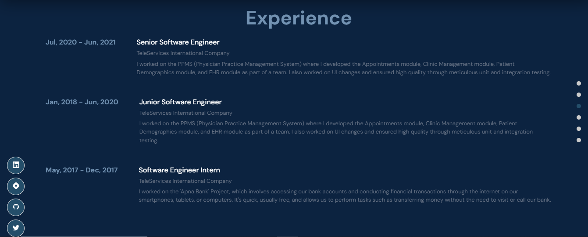
    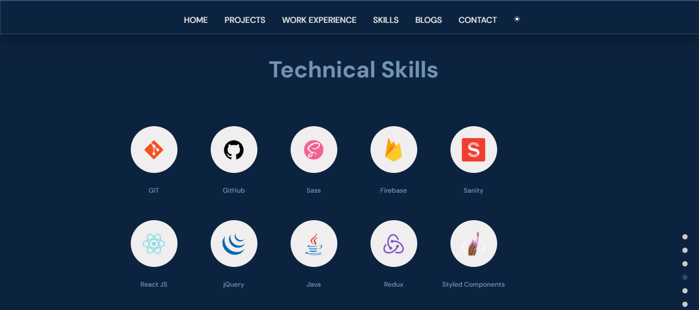
    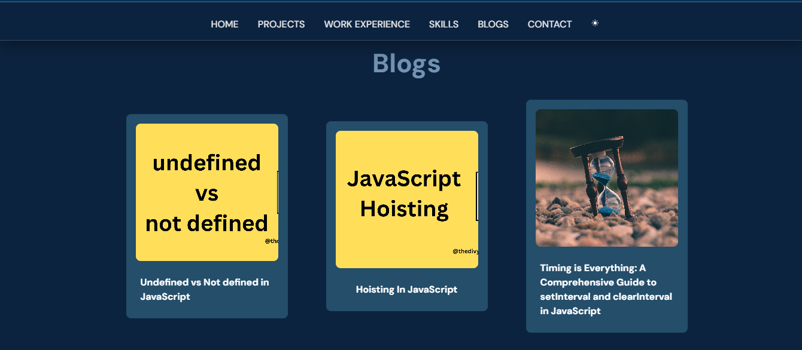
    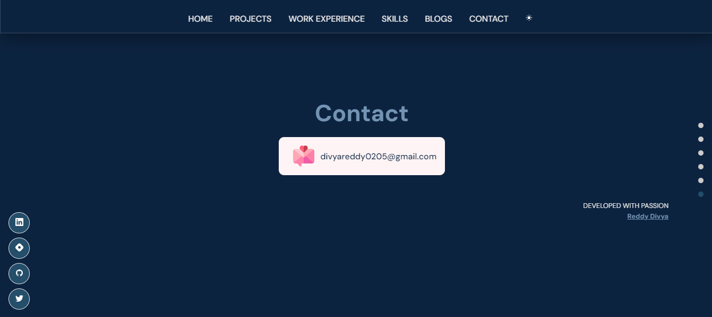

### Light Mode

    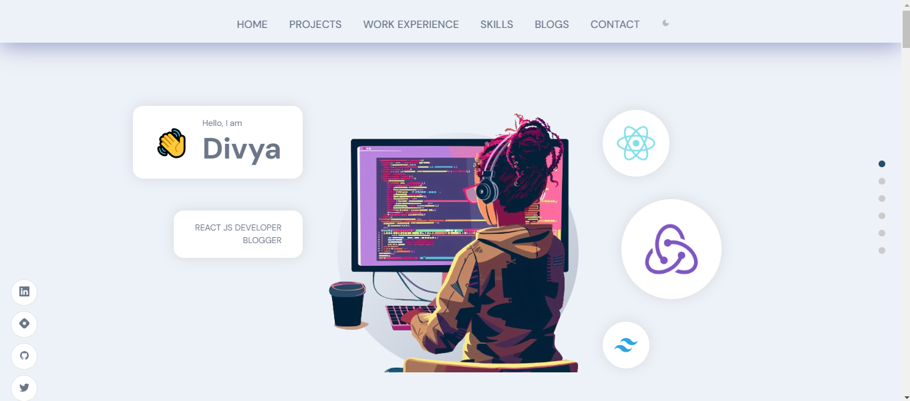
    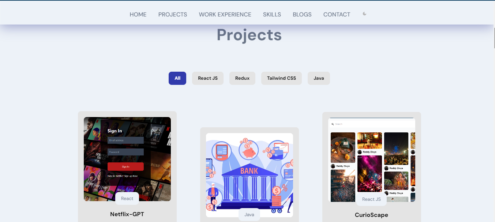
    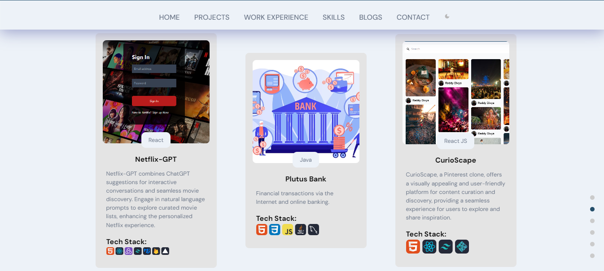
    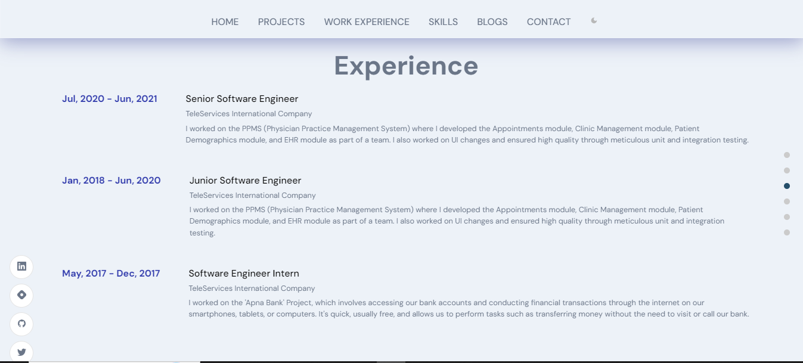
    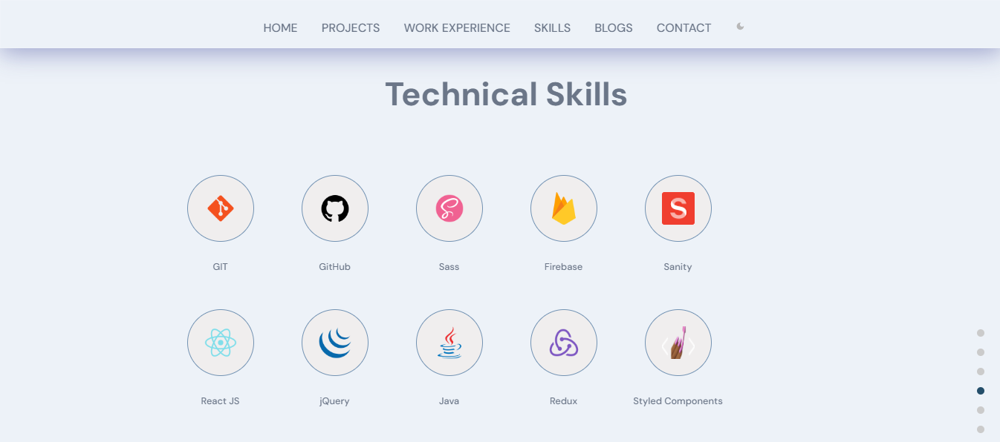
    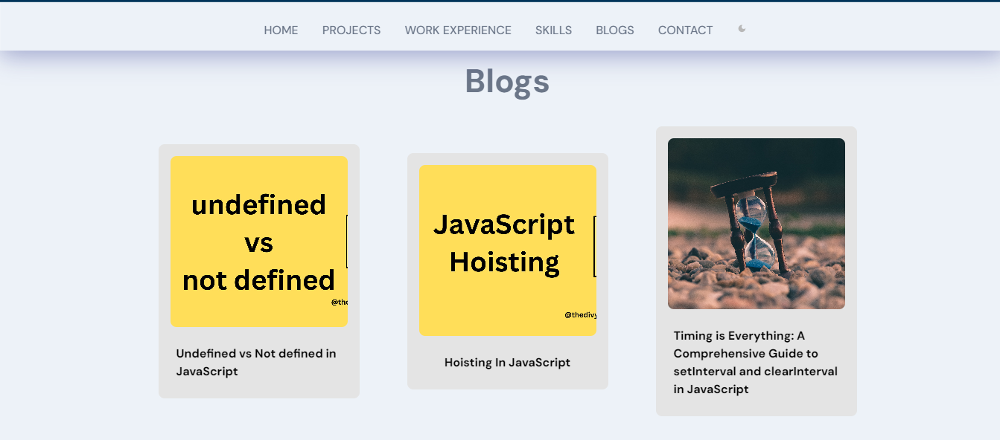
    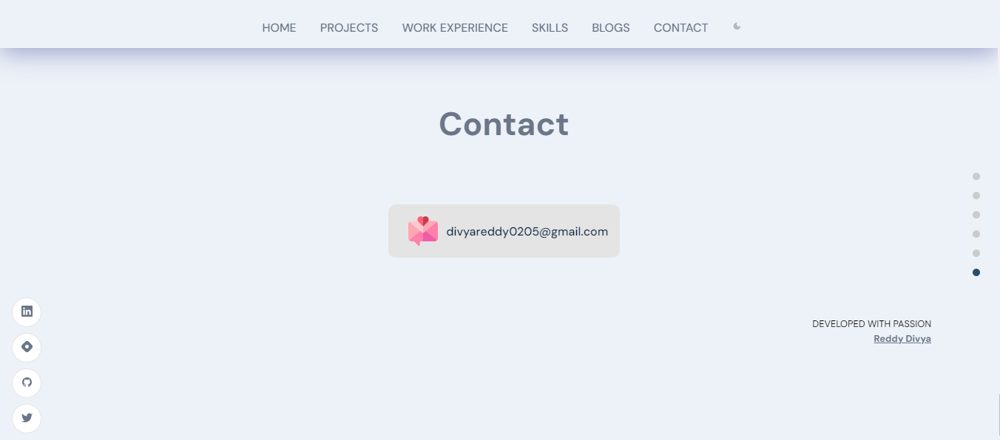

## Technologies

    - React
    - React Router Dom
    - Node.js
    - Sanity
    - CSS
    - HTML5
    - React Icons

## Contact

Email: divyareddy0205@gmail.com
LinkedIn: [Reddy Divya](https://www.linkedin.com/in/reddy-divya-58025a12b/)
Twitter: [@thedivyareddyy](https://x.com/thedivyareddyy)
